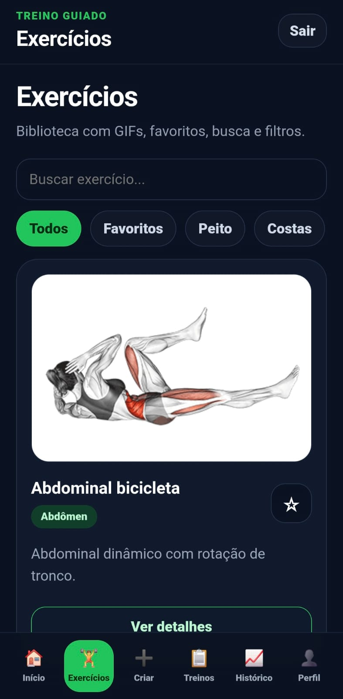
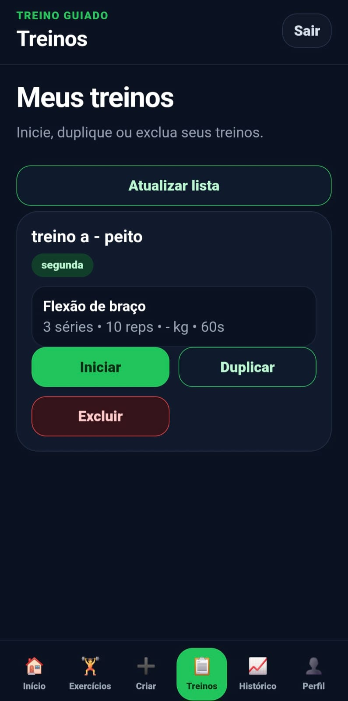
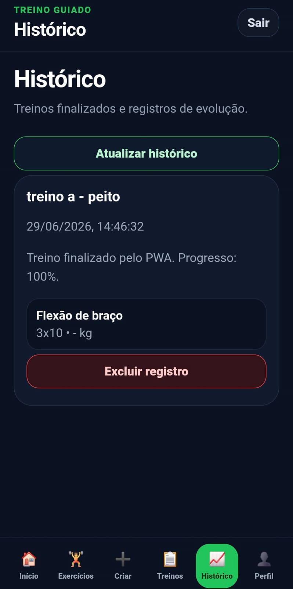
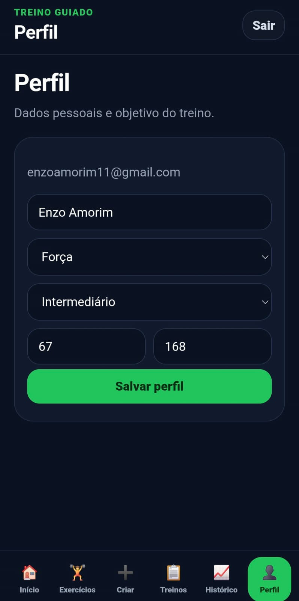

# 🏋️ Treino Guiado PWA

Um aplicativo web progressivo para controle de treinos, exercícios com GIF, histórico de evolução e organização da rotina de academia.

O projeto foi desenvolvido com foco em uso mobile, podendo ser acessado pelo navegador e instalado na tela inicial do celular como um PWA.

---

## 🔗 Acesse o projeto

[Ver projeto online](https://treino-guiado-pwa.vercel.app)

---

## 📱 Preview

<table>
  <tr>
    <td align="center" width="25%">
      <strong>Login</strong> 
      
    </td>
    <td align="center" width="25%">
      <strong>Dashboard</strong> 
      
    </td>
    <td align="center" width="25%">
      <strong>Exercícios</strong> 
      
    </td>
    <td align="center" width="25%">
      <strong>Criar treino</strong> 
      
    </td>
  </tr>

  <tr>
    <td align="center" width="25%">
      <strong>Treino em andamento</strong> 
      
    </td>
    <td align="center" width="25%">
      <strong>Histórico</strong> 
      
    </td>
    <td align="center" width="25%">
      <strong>Perfil</strong> 
      
    </td>
  </tr>
</table>

---

## 🚀 Funcionalidades

- Cadastro e login de usuários
- Dashboard com resumo dos treinos
- Biblioteca de exercícios com GIFs explicativos
- Filtro por grupo muscular
- Favoritar exercícios
- Criação de treinos personalizados
- Edição, duplicação e exclusão de treinos
- Treino em andamento com checklist
- Timer de descanso
- Registro de histórico
- Exclusão de histórico
- Perfil do usuário
- Interface responsiva com foco em celular
- Instalação como PWA

>>>>>>> 0c28f58 (Atualiza README com prints do projeto)
---

## 🛠️ Tecnologias utilizadas

- React
- Vite
- JavaScript
- Supabase
- CSS
- PWA
<<<<<<< HEAD
- Vercel
=======
- Vercel
>>>>>>> 0c28f58 (Atualiza README com prints do projeto)
